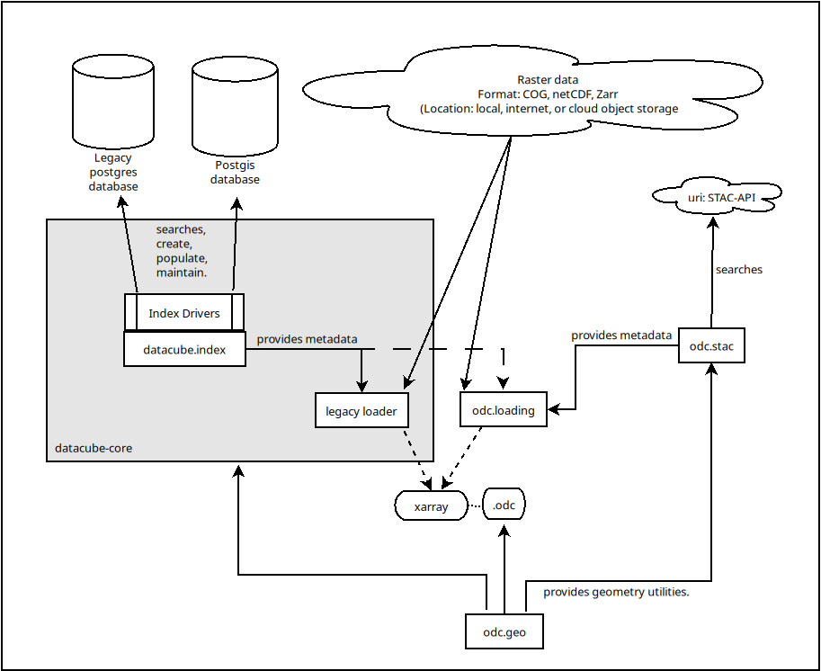

*********************
About & Core Concepts
*********************

Overview
========

The Open Data Cube is a collection of software designed to:

* Index large amounts of Earth observation data, which can be stored on a file system or
  a cloud platform
* Provide a :term:`Python` based :term:`API` for high performance querying and data access
* Give scientists and other users easy ability to perform exploratory data analysis
* Allow continental-scale processing of the stored data
* Track the provenance of all the contained data to allow for quality control and updates

The Open Data Cube software is based around the datacube-core_ library. In addition to this
core library, there are a range of tools that can be installed on top to enable
further capabilities, such as open web services or metadata exploration.

All software in the Open Data Cube project family is released under the `Apache 2.0
<https://github.com/opendatacube/datacube-core/blob/develop/LICENSE>`_ license.

.. figure:: ../diagrams/f1.png
   :name: high-level-overview

   High-Level ODC Overview

.. _datacube-core: https://github.com/opendatacube/datacube-core

Packages
========

Key packages in the Open Data Cube ecosystem include:

* ``odc-geo``: Provides low level geometry, CRS handling and reprojecting utilities, and the `.odc`
  xarray extensions.
* ``odc-loading``: Provides tools for loading data from files in local or cloud storage into
  xarray objects.  (Depends on ``odc-geo``)
* ``odc-stac``: Supports integrated data discovery from STAC API endpoints and loading of data into
  xarray objects.  (Depends on ``odc-geo`` and ``odc-loading``)
* ``datacube`` (aka ``datacube-core``: Supports integrated data discovery from a locally-maintained ODC
  database, and loading of data into xarray objects.  (Depends on ``odc-geo``.  Supports extended loading
  features using ``odc-loading``, but also has it's own legacy loading engine)
* ``datacube-explorer``: Provides a web-based front end and a STAC-API endpoint for browsing and searching
   the contents of an ODC database.  (Depends on ``odc-geo`` and ``datacube-core``)
* ``datacube-ows``: Provides WMS, WMTS, and WCS web service endpoints for serving data from one or more
  ODC databases, for supplying raw data or rendered visualisations to web maps or GIS applications.  Includes a
  powerful configurable visualisation library.  (Depends on ``odc-geo`` and ``datacube-core``)
* ``odc-apps-dc-tools``: Provides a collection of command line tools for indexing large data collections
  into an ODC database from various locations, including local file system, s3 buckets. Note that these tools
  assume that metadata for the data being indexed is already available, in either eo3 or STAC format.
  (Depends on ``odc-geo`` and ``datacube-core``)
* ``eodatasets3``: Provides tools for generating eo3 format metadata and repackaging data in COG format.
  (Depends on ``odc-geo`` and ``datacube-core``)
* ``odc-algo``: a Python library providing EO processing and analysis methods (Depends on ``odc-geo``
  and ``datacube-core``)
* ``odc-stats`` (aka ``Statistician``): Supports cloud-scalable generation of statistical summary products.
  (Depends on ``odc-geo``, ``datacube-core`` and ``odc-algo``).
* ``datacube-alchemist``: Supports generation of cloud-scalable generation of derivative products.
  (Depends on ``odc-geo``, ``datacube-core``, ``odc-algo``, ``eodatasets3`` and ``odc-apps-dc-tools``)

Datacube-core or odc-stac?
--------------------------

``datacube-core`` provides many powerful tools and services, however many the needs of many new users
can be met much more easily with ``odc-stac``.  If you have access to an ODC database that somebody else
maintains, you probably already have access to an environment with datacube-core installed and configured.
If you want to create and maintain your own ODC database, you will need to install ``datacube-core``.  Most
other use case scenarios should look at ``odc-stac`` first.

This diagram shows the relationships between, and highlights the differences between ``odc-stac`` and
``datacube-core``, as of datacube 1.9:

   Datacube-core vs odc-stac

Use Cases
=========

The Open Data Cube has a range of uses, including the following:

* **Collection Management:** The ODC can be used as an index to assist in managing a collection
  of Earth observation data, including lineage (parent/child relationships).
* **Exploratory Data Analysis:** Interactive analysis of data, such as through a Jupyter Notebook.
* **Publishing Web Services:** Using the :abbr:`ODC (Open Data Cube)` to serve :abbr:`WMS (Web Map Service)`, :abbr:`WCS (Web Coverage Service)`,
  :abbr:`WPS (Web Processing Service)` or custom tools (such as polygon drill time series analysis).
* **Large-scale workflows on Cloud:** Continental or global-scale processing of data on the cloud
  using XArray and Dask on Kubernetes, for example.
* **Large-scale workflows on HPC:** Continental or global-scale processing of data on a High
  Performance Computing supercomputer cluster.
* **Standalone Applications:** Running environmental analysis applications on a laptop,
  suitable for field work, or outreach to a developing region.

.. toctree::
    :caption: About & Core Concepts

    Overview & Use Cases <self>

.. toctree::
    :caption: Core Concepts

    architecture-guide
    datasets
    products
    metadata-types

.. toctree::
    :caption: Ecosystem

    extensions
    existing-deployments
